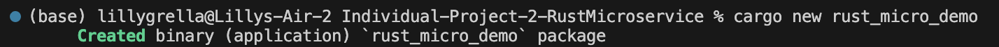
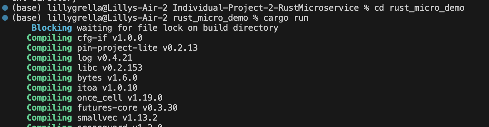
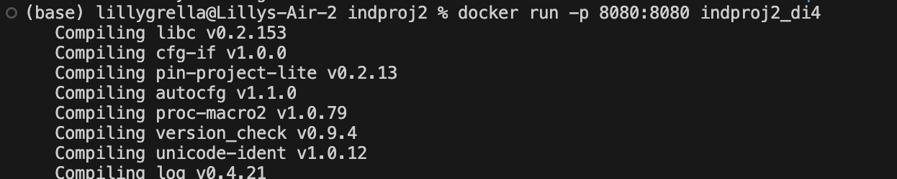
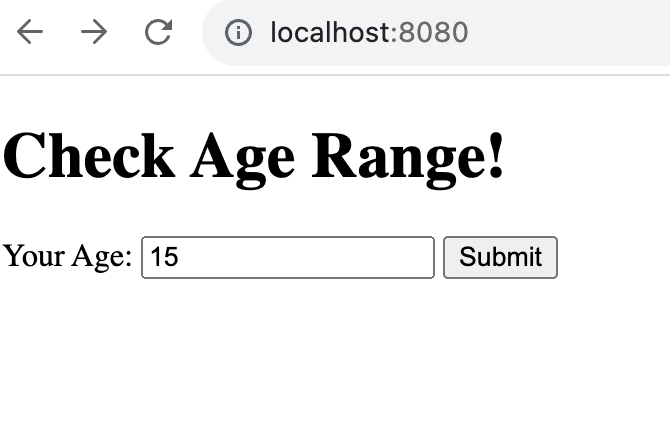
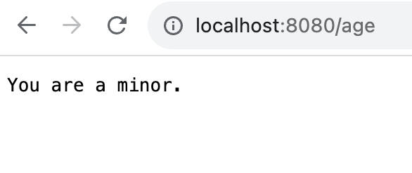
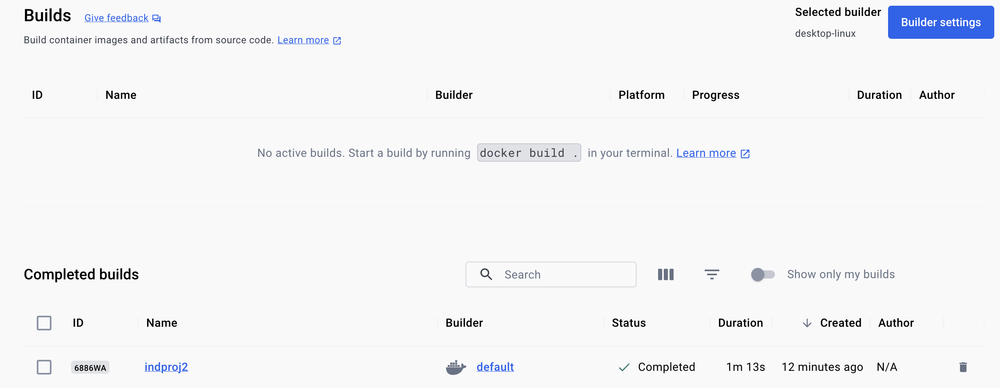
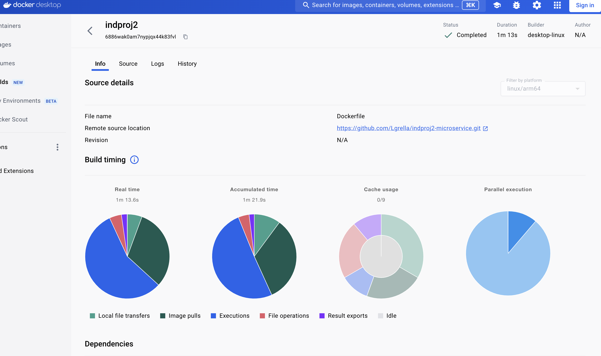
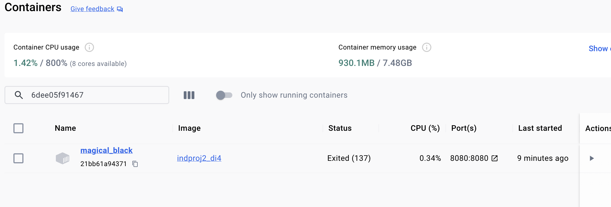
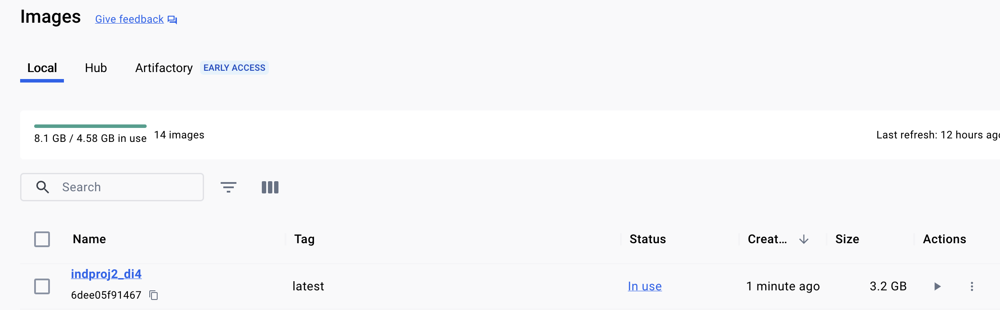

# Individual Project 2: Continuous Delivery of a Rust Microservice 

## Dependencies
Confirm you have installed the following: 
  * Rust
  * Docker
  * Cargo

## Start a new Rust Project
Run `Cargo new {Project Name}` to create a new rust project

## Update dependencies for this project
Update the `Cargo.toml` file to reflect the required crates for this project. This includes: 
  * actix-web = "4"
  * serde = { version = "1.0", features = ["derive"] }

## Update src/main.rs to reflect the intentions of the project
  * I decided to include a numeric entry box that takes an age. In response, the API routes the user to a new webpage (/age) that tells the user whether they are a minor, adult, or senior.
  * main.rs includes the frontend html script, the function that takes the user input and transforms it into a response, and the pointer to the new webpage

## Confirm the application works locally
  * run `cargo run` in the terminal to test whether the application works
  * This will run the application in `localhost:8000`
  * Make sure to interact with the app to confirm it is working as expected

## Containerize the application
  * After making sure the application is working as expected, make sure docker desktop is up and running and you are signed in online
  * Create a Dockerfile document in the main folder. This includes the steps to create an image.
  * Run `docker build -t {docker image name} .` to build the image
  * Run `docker run -p 8080:8080 {docker image name}` to run the containerized application
  * Confirm the docker image works by checking Docker desktop and the location where the containerized application is running.

## CI/CD 
  * Due to monitary (and processing) restrictions, I chose to perform CI/CD on the application on any releases of the code. See the .yaml file within .github/workflows for more information.

# Screenshots

## Terminal 

## Working Application

## Containerization

### Docker Build

### Docker Container

### Docker Image

